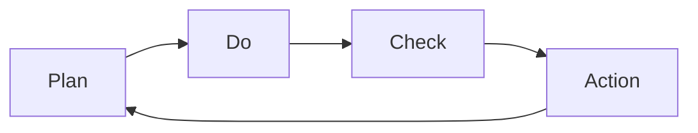
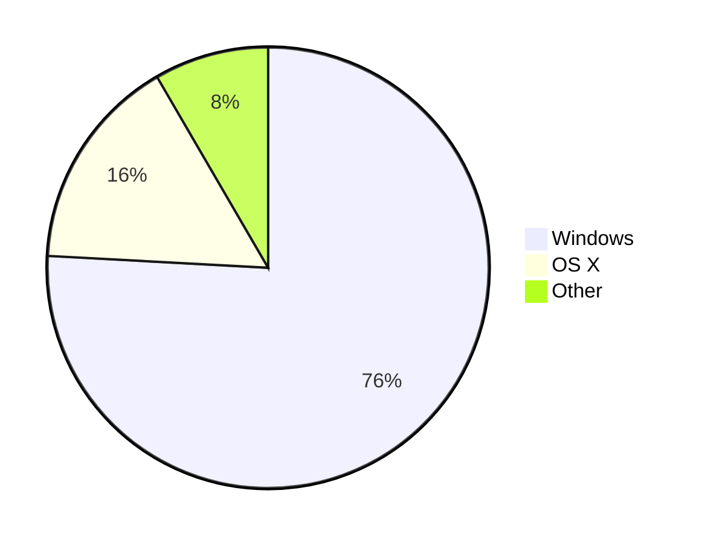

# md2html (diag)

```go
package main

import "fmt"

func main() {
	fmt.Println("Hello, World!")
}
```


```mermaid
flowchart LR;
  Plan   --> Do;
  Do     --> Check;
  Check  --> Action;
  Action --> Plan;
```


```mermaid
pie
  "Windows" : 75.86
  "OS X"    : 15.76
  "Other"   :  8.38
```
